# 问卷系统（阶段一）

## 文档

| 文档 | 内容 |
|------|------|
| [docs/SYSTEM.md](docs/SYSTEM.md) | 系统说明（定位、技术栈、架构、目录） |
| [docs/DATABASE.md](docs/DATABASE.md) | 数据库设计（集合、字段、索引） |
| [docs/API.md](docs/API.md) | API 说明 |
| [docs/LOGIC.md](docs/LOGIC.md) | 关键逻辑（跳转、校验、填写、统计） |
| [手工测试/手工测试流程与结果.md](手工测试/手工测试流程与结果.md) | 手工测试问卷系统工作流是否正常，包括 `创建问卷测试`、`添加题目测试`、`跳转逻辑测试`、`校验测试`、`提交问卷测试`、`统计测试` |
| [mongodb_schema_doc/](mongodb_schema_doc/) | 报告用完整 Schema 分文件（5 集合 + 索引脚本 + ER 图 Mermaid） |


## 运行

- 进入项目目录  
```bash
cd test1
```
- 创建虚拟环境并激活  
```bash
python3 -m venv .venv
source .venv/bin/activate   # Windows 系统: .venv\Scripts\activate
```
- 安装依赖  
```bash
pip install -r requirements.txt  # 或 python -m pip install -r requirements.txt
```
- 拷贝环境变量模板并按需修改  
```bash
cp .env.example .env
# 按需修改 .env（MongoDB、SECRET_KEY 等）
```
- 启动服务  
```bash
python -m uvicorn app.main:app --reload --port 8000
```

浏览器访问 `http://127.0.0.1:8000/`（静态页）、API 文档 `http://127.0.0.1:8000/docs`。

- 登录注册
```markdown
点击右上角 `登录` 或 `注册` 按钮进行登录 / 注册
```

## 测试

```bash
pytest
```

无 MongoDB 时集成测试会自动跳过；单元测试不依赖数据库。

## 界面效果

- 登录注册
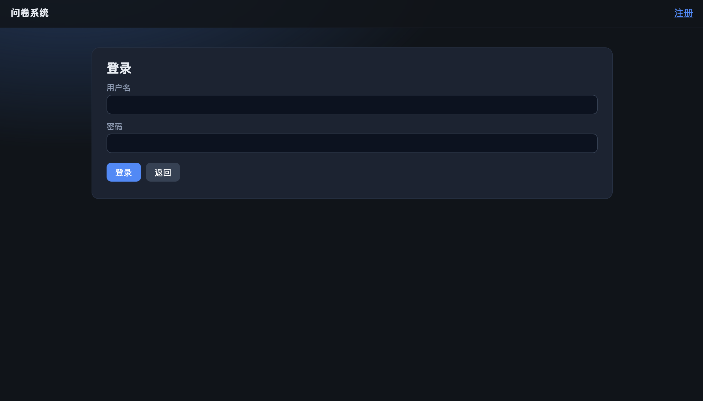
- 主页
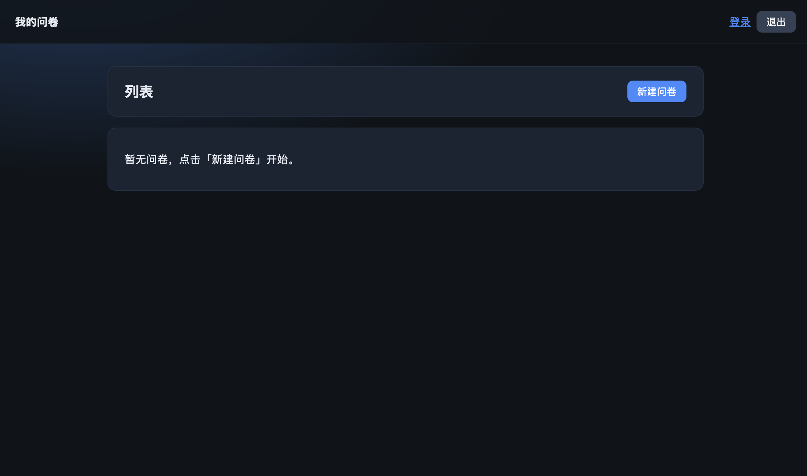
- 填写问卷（左侧可填写问卷名称、说明，是否允许同一用户多次填写等）
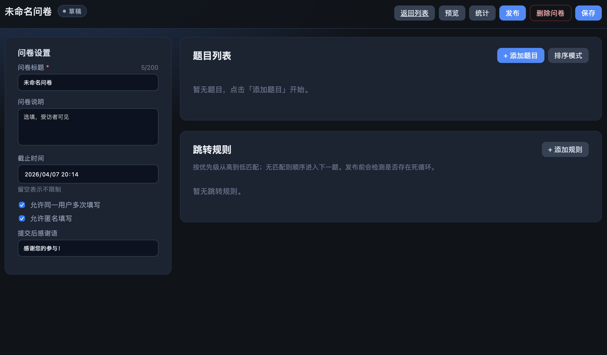
- 编辑单选题
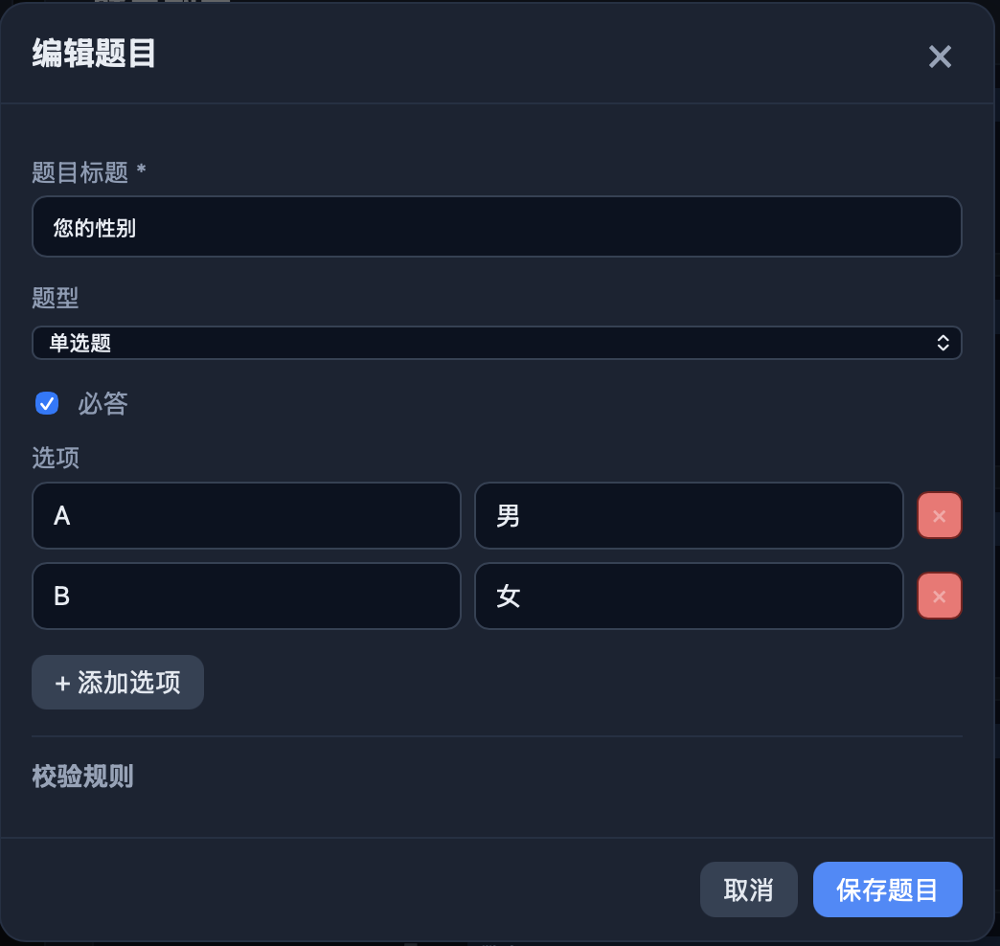
- 编辑多选题（可设置选项数量）
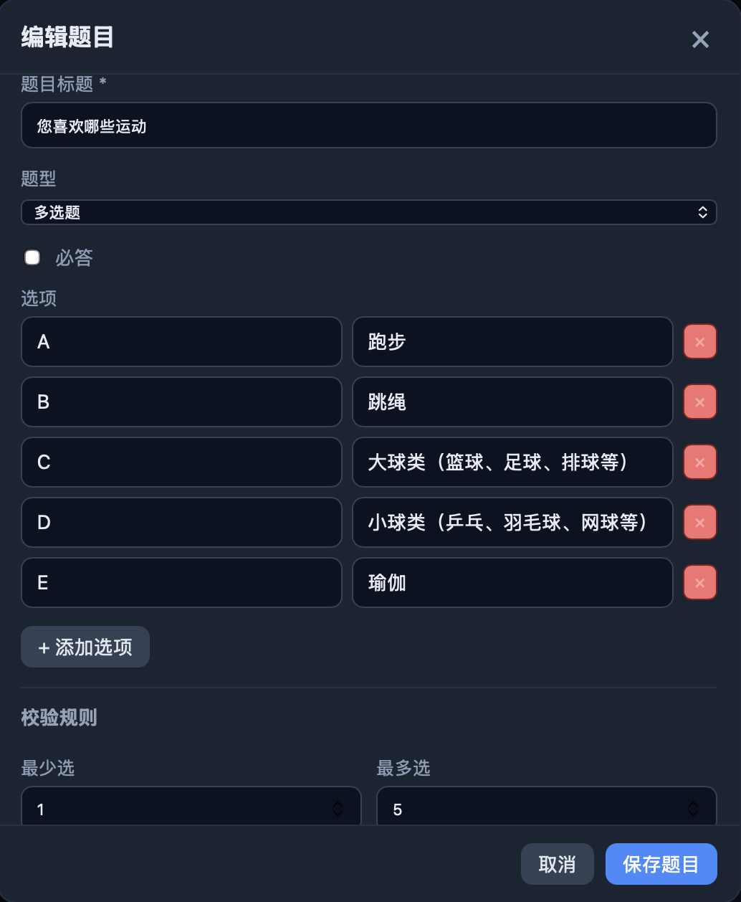
- 编辑填空题（可设置文字数量）
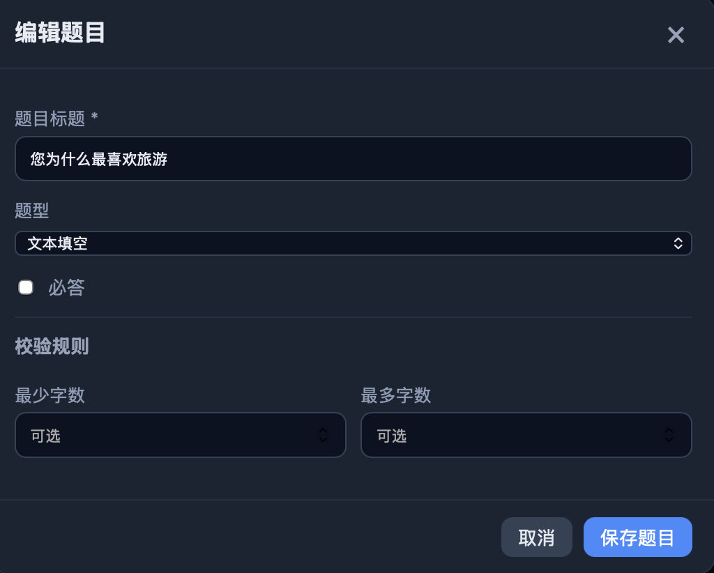
- 编辑数字填空题（可设置数字大小、是否为整数）
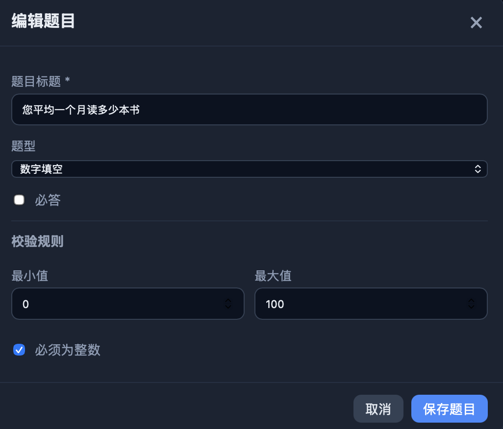
- 制定跳转规则（[详细跳转规则见：mongodb_schema_doc/jump_rules.md](mongodb_schema_doc/jump_rules.md)）
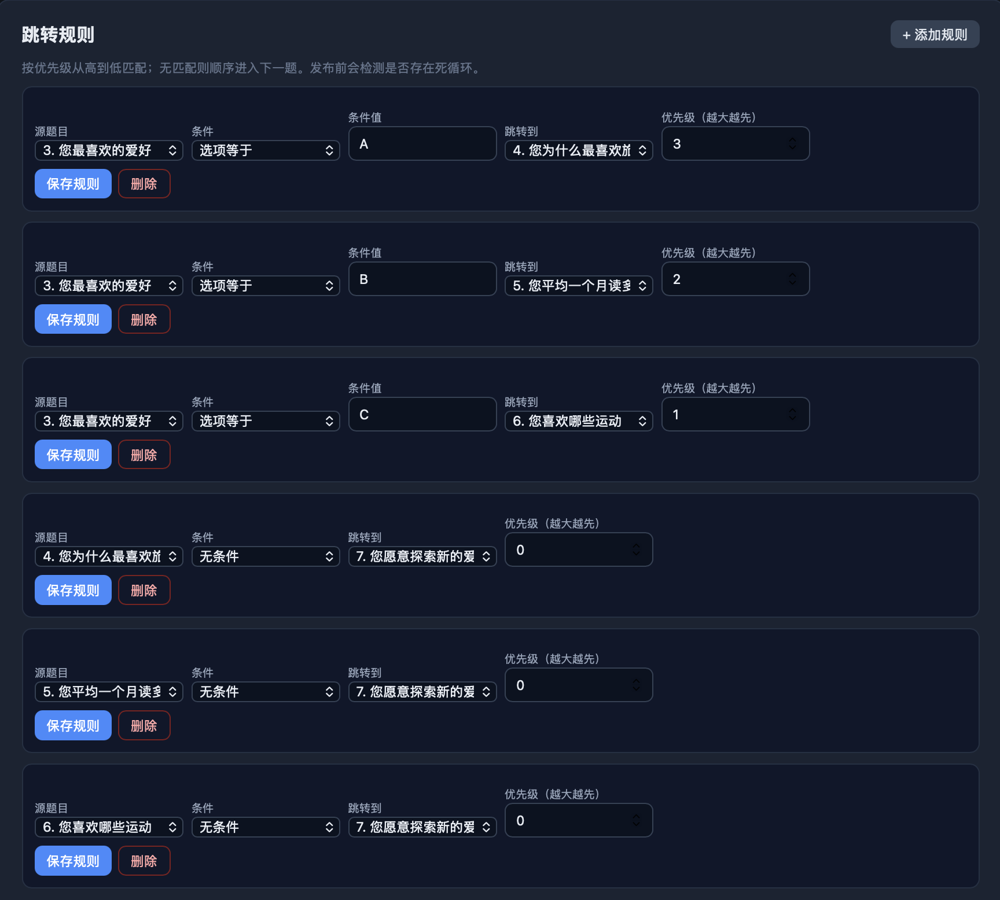
- 填写单选题
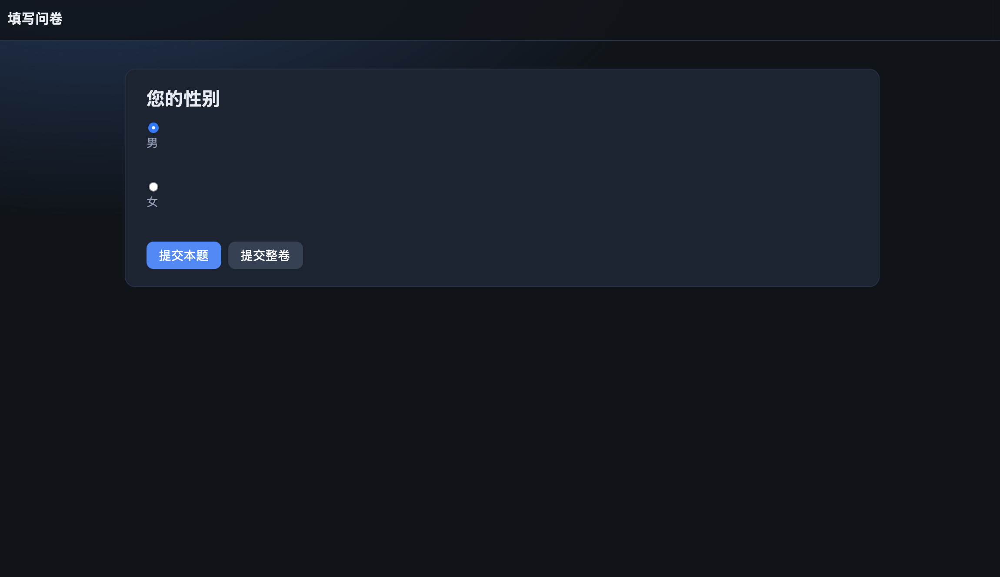
- 填写多选题
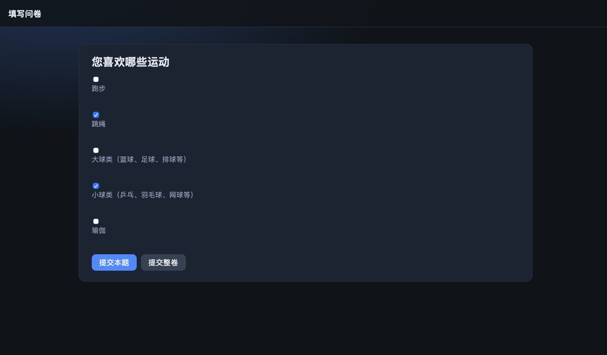
- 填写填空题
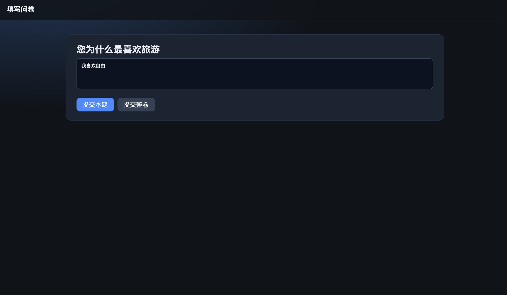
- 填写数字填空题
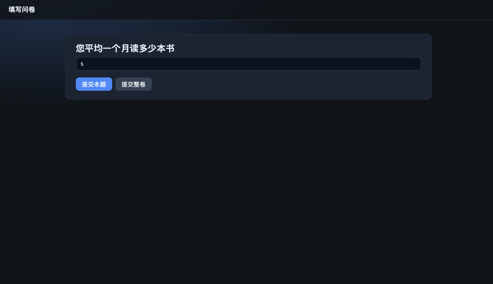
- 问卷统计报告
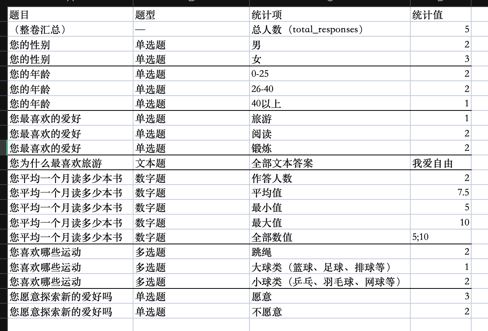
    - 参与问卷调查的总人数
    - 单选题/多选题：统计选择各个选项的人数
    - 文本题：所填写的内容
    - 数字题：平均值、最大值、最小值、所有数值
