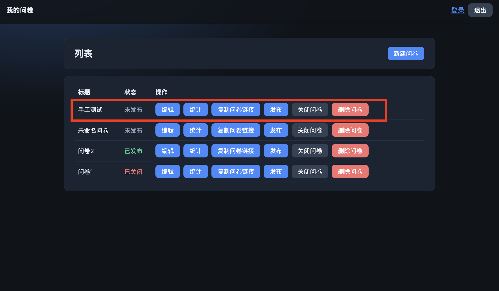
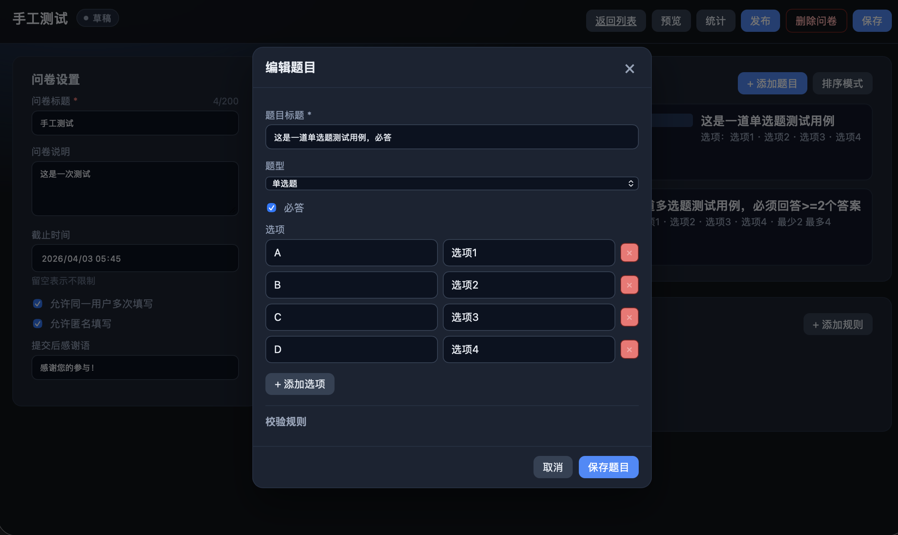
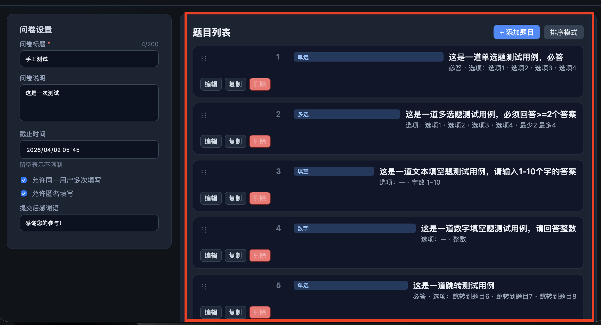
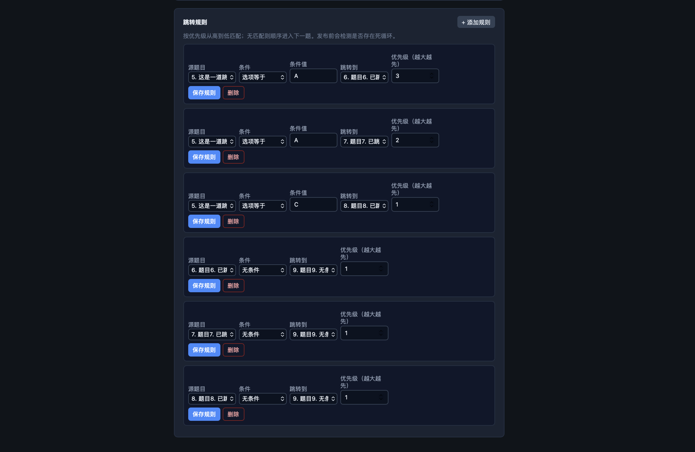
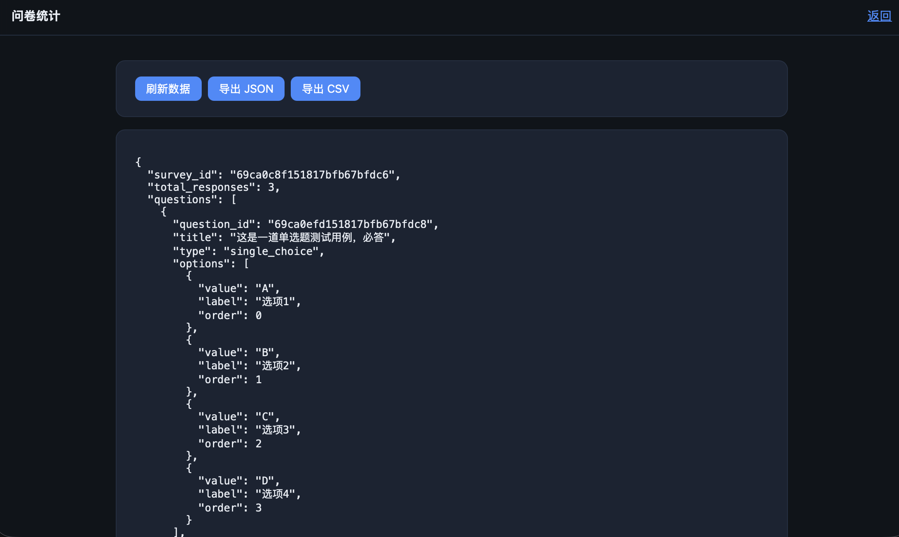
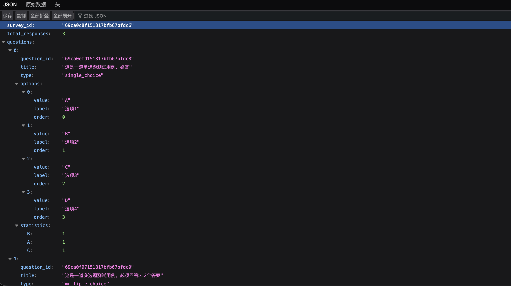
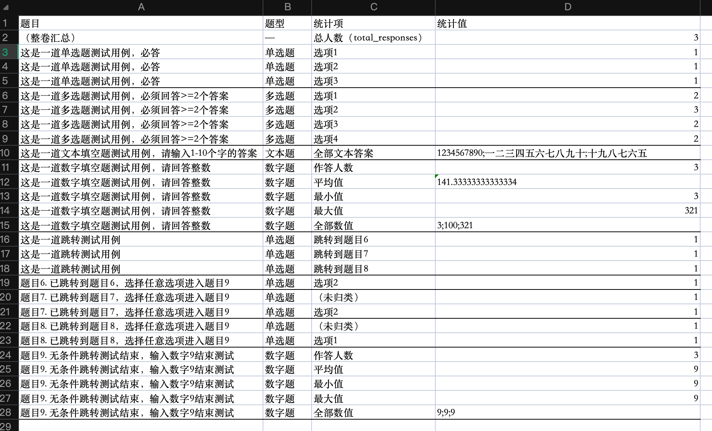

# 问卷系统手工测试流程

---

## 1. 创建问卷测试 

---

- 点击主页 `新建问卷`，前端显示

- 点击 `保存` ，返回主页后，前端正常显示保存后的问卷

- 测试通过

---

## 2. 添加题目测试 

---

- 在问卷编辑界面点击 `添加题目` 按钮，前端显示

- 同理，建立 `多选题`、`文本填空题`、`数字填空题` 测试用题
- 点击 `保存题目` 按钮，题目列表中正常显示已添加的题目


- 测试通过

---

## 3. 跳转逻辑测试 

---

- 点击 `添加规则` 按钮，建立跳转规则

```md
规则一：第5题 选 A -> 第6题 优先级: 3
规则二：第5题 选 A -> 第7题 优先级: 2 (与 `规则一` 冲突，但优先级小于 `规则一`)
规则三：第5题 选 C -> 第8题 优先级: 1
规则四：第6题 无条件 -> 第9题 优先级: 1
规则五：第7题 无条件 -> 第9题 优先级: 1
规则六：第7题 无条件 -> 第9题 优先级: 1
```
- 发布问卷，复制问卷链接，进入填写问卷界面进行跳转测试

- 依据 `规则一`，正确跳转至 `题目6`：

- 依据 `规则四`，正确跳转至 `题目9`：

- 跳转结果符合规则，测试通过

---

## 4. 校验测试 

---

- 发布问卷，复制问卷链接，进入填写问卷界面进行校验测试

### 4.1. 校验必答

- 不回答无法跳转至下一题


### 4.2. 校验多选题选项个数

- 不按照校验规则中限定的选项数量，无法跳转至下一题


### 4.3. 校验文本填空题文本长度

- 不按照校验规则中限定的文本长度，无法跳转至下一题


### 4.4. 校验数字填空题数字是否为整数

- 不按照校验规则中的限定输入整数，无法跳转至下一题


### 4.5. 校验数字填空题数字大小范围

- 不按照校验规则中限定的数字大小，无法跳转至下一题


- 所有题目答题要求符合校验规则，测试通过

---

## 5. 提交问卷测试 

---

- 所有题目显示完毕，且完成所有 `必答题` 后，进入 `提交问卷` 界面

- 点击 `提交整卷` 按钮后，显示 `完成` 与问卷制作者规定的 `提交后感谢语`

- 测试通过

---

## 6. 统计测试

---

- 点击相应问卷的 `统计` 按钮，进入该问卷的统计界面

- 点击上方 `导出 JSON` 按钮，即可自动下载原版 `JSON` 数据

- 点击上方 `导出 CSV` 按钮，即可自动下载 `CSV` 统计数据

- 数据正确且统计量格式清晰，测试通过